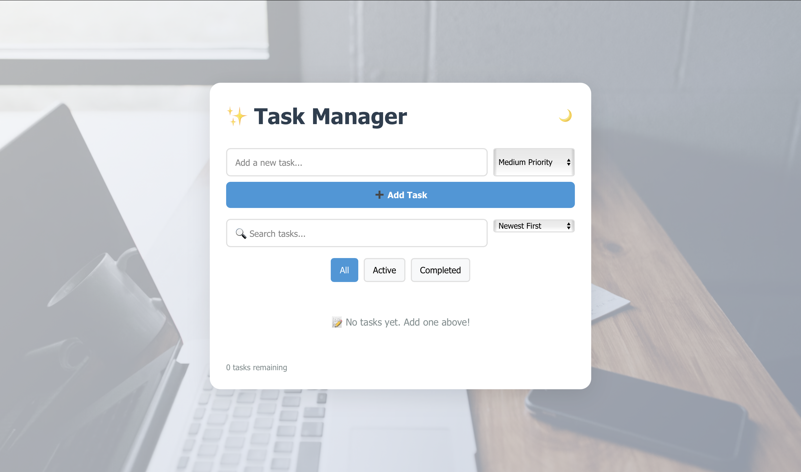

# ✨ Modern Task Manager

A beautiful, feature-rich task management application built with React. Organize your daily tasks with an intuitive interface, powerful filtering, priority management, and smooth animations.

 

## 🚀 Live Demo

👉 **[Try it now!](https://todo-app-e.vercel.app)** 👈

Experience the full-featured task manager with all its capabilities. No installation required!

## 📸 Screenshots

### Light Mode


### Dark Mode


## 🎯 Features

### Core Functionality
- ✅ **Add, Edit & Delete Tasks** - Full CRUD operations with inline editing
- 🎨 **Priority Levels** - High, Medium, and Low priority with color-coded badges
- 🔍 **Search & Filter** - Real-time search and filter by status (All, Active, Completed)
- 📊 **Task Statistics** - View total, active, completed tasks with progress bar
- 🎯 **Smart Sorting** - Sort by newest, oldest, priority, or alphabetically
- 💾 **Local Storage** - All tasks automatically saved to browser storage
- 🌓 **Dark/Light Mode** - Beautiful themes with stunning background images

### User Experience
- 🎬 **Smooth Animations** - Powered by Framer Motion for delightful interactions
- 📱 **Fully Responsive** - Works perfectly on desktop, tablet, and mobile devices
- ⚡ **Fast Performance** - Optimized for speed and efficiency
- 🎨 **Modern UI** - Clean, minimalist design with beautiful gradients
- 🔔 **Visual Feedback** - Hover effects, transitions, and interactive elements

### Advanced Features
- 📅 **Date Tracking** - See when tasks were created (Today, Yesterday, X days ago)
- 🎨 **Priority Indicators** - Color-coded borders and badges for quick identification
- 📈 **Progress Tracking** - Visual progress bar showing completion percentage
- 🗑️ **Bulk Actions** - Clear all tasks or only completed ones
- ⌨️ **Keyboard Shortcuts** - Press Enter to save, Escape to cancel when editing

## 🚀 Getting Started

### Prerequisites

- Node.js (v14 or higher)
- npm or yarn

### Installation

1. **Clone the repository**
   ```bash
   git clone https://github.com/your-username/to-do-app.git
   cd to-do-app
   ```

2. **Install dependencies**
   ```bash
   npm install
   ```

3. **Start the development server**
   ```bash
   npm start
   ```

4. **Open your browser**
   Navigate to `http://localhost:3000` to see the app in action!

### Build for Production

```bash
npm run build
```

This creates an optimized production build in the `build` folder.

## 💻 Usage Guide

### Adding Tasks
1. Type your task in the input field
2. Select a priority level (Low, Medium, High)
3. Click "Add Task" or press Enter


### Managing Tasks
- **Complete a task**: Click the checkbox next to the task
- **Edit a task**: Click the ✏️ edit button, modify the text/priority, then press Enter or click ✓
- **Delete a task**: Click the 🗑️ delete button
- **Cancel editing**: Press Escape or click ✕


### Filtering & Searching
- **Filter by status**: Use the All/Active/Completed buttons
- **Search tasks**: Type in the search box to filter tasks in real-time
- **Sort tasks**: Use the dropdown to sort by:
  - Newest First
  - Oldest First
  - Priority (High → Low)
  - Alphabetical (A-Z)


### Theme Switching
Click the 🌙/☀️ button in the top-right corner to toggle between dark and light themes.


### Statistics
View your productivity at a glance:
- **Total**: All tasks in your list
- **Active**: Tasks not yet completed
- **Completed**: Finished tasks
- **Progress**: Completion percentage with visual progress bar


## 🛠️ Technologies Used

- **React 19.1.0** - Modern React with latest features
- **Framer Motion 12.12.1** - Smooth animations and transitions
- **React Scripts 5.0.1** - Build tooling and development server
- **CSS3** - Custom styling with modern features
- **Local Storage API** - Client-side data persistence
- **Tailwind CSS 4.1.7** - Utility-first CSS framework (configured)

## 📁 Project Structure

```
to-do-app/
├── public/
│   ├── index.html
│   └── ...
├── src/
│   ├── components/
│   │   ├── TodoForm.js      # Task input form
│   │   ├── TodoItem.js      # Individual task component
│   │   └── TodoList.js       # Task list container
│   ├── App.js               # Main application component
│   ├── App.css              # Main stylesheet
│   ├── index.js             # Entry point
│   └── index.css            # Global styles
├── screenshots/             # Application screenshots
│   ├── light-mode.png
│   ├── dark-mode.png
│   ├── task-management.png
│   ├── statistics.png
│   ├── mobile-view.png
│   ├── adding-tasks.png
│   ├── managing-tasks.png
│   ├── filtering-searching.png
│   ├── theme-switching.png
│   └── statistics-detail.png
├── package.json
└── README.md
```

## 🎨 Customization

### Changing Colors
Edit `src/App.css` to customize:
- Priority colors (high, medium, low)
- Theme colors
- Button styles
- Background gradients

### Modifying Animations
Adjust Framer Motion animations in:
- `src/components/TodoItem.js`
- `src/components/TodoList.js`

### Background Images
Update background images in `src/index.css`:
- Light mode: `body` selector
- Dark mode: `body.dark` selector

## 🧪 Testing

Run the test suite:

```bash
npm test
```

## 📦 Build & Deploy

### Build
```bash
npm run build
```

### Deploy to Vercel
```bash
npm install -g vercel
vercel
```

### Deploy to Netlify
1. Build the project: `npm run build`
2. Drag and drop the `build` folder to Netlify
3. Or connect your GitHub repository for automatic deployments

## 🤝 Contributing

Contributions are welcome! Please feel free to submit a Pull Request.

1. Fork the repository
2. Create your feature branch (`git checkout -b feature/AmazingFeature`)
3. Commit your changes (`git commit -m 'Add some AmazingFeature'`)
4. Push to the branch (`git push origin feature/AmazingFeature`)
5. Open a Pull Request

## 📝 License

This project is licensed under the MIT License - see the [LICENSE](LICENSE) file for details.

## 🙏 Acknowledgments

- [React](https://reactjs.org/) - The JavaScript library for building user interfaces
- [Framer Motion](https://www.framer.com/motion/) - Production-ready motion library
- [Unsplash](https://unsplash.com/) - Beautiful background images
- The open-source community for inspiration and support

## ⭐ Show Your Support

If you find this project helpful, please give it a ⭐ on GitHub!

---

**Made with ❤️ using React**
